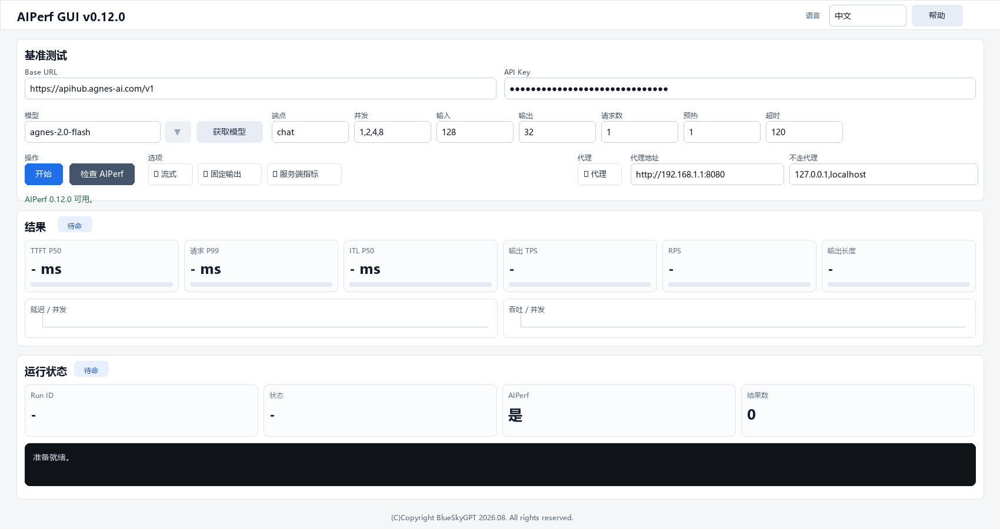

# AIPerf GUI

[中文](README.md) | English | [Francais](README.fr.md) | [Deutsch](README.de.md) | [Espanol](README.es.md)

AIPerf GUI is a Docker-packaged Web console for NVIDIA AIPerf 0.12.0. It helps benchmark OpenAI-compatible model services with concurrency sweeps, latency metrics, throughput metrics, model discovery, proxy settings, and live logs.



## Features

- Based on `nvcr.io/nvidia/ai-dynamo/aiperf:0.12.0`
- Local Web GUI on port `8080`
- Supports `chat` and `completions`
- Manual model entry plus `/models` fetching
- Concurrency sweeps such as `1,2,4,8,16`
- Configurable input tokens, output tokens, requests, warmup, and timeout
- Streaming, fixed output, server metrics, proxy, and no-proxy controls
- Result cards and charts for TTFT, request latency, ITL, output TPS, RPS, and output length
- Separate multilingual help page

## Quick Start

```bash
./build.sh
./run.sh
```

Open:

```text
http://127.0.0.1:8080
```

## License

GNU General Public License v3.0. See [LICENSE](LICENSE).
